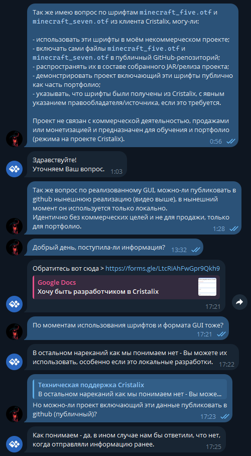

# Ответ поддержки Cristalix и решение об интеграции

Область использования: некоммерческий учебный/портфолио-проект RE:volution, без продаж и монетизации. Источник: предоставленный пользователем скриншот переписки с чат-ботом технической поддержки Cristalix, полученный в ходе задачи 10 октября 2026 года. Скриншот не позволяет установить календарную дату самой переписки.

Вопрос пользователя прямо называет `minecraft_five.otf` и `minecraft_seven.otf`, использование в проекте, размещение в публичном GitHub, распространение в собранном JAR и релизах, демонстрацию в портфолио и указание источника. Следующий вопрос касается публикации реализованного GUI. Поддержка отвечает, что, насколько они понимают, возражений нет, особенно для локальной разработки. На прямой уточняющий вопрос о публичном GitHub поддержка отвечает: «Как понимаем - да, в ином случае нам бы ответили, что нет, когда отправляли информацию ранее.»

Решение: использовать эти два шрифта и код визуального представления GUI в описанном некоммерческом проекте, опираясь на этот ответ поддержки. Это запись переписки с оговорками в формулировках, а не новая общая лицензия на шрифты или разрешение на коммерческое использование. Разрешение на другие ассеты клиента из неё не выводится. Встроенные метаданные шрифтов сохранены. Другие клиентские текстуры и темы, ожидающие разрешения, по-прежнему запрещены проверкой публичной сборки.

Шрифты получены из установленного у пользователя клиента Cristalix Minigames: `libraries/mcassets.jar`, `assets/minecraft/fonts/minecraft_{five,seven}.crifont` → `font.otf`. Источник и указание авторства: Cristalix; встроенные названия — `MinecraftFivev2-Regular` и `MinecraftSevenv2-Regular`. Общая `LICENSE` репозитория не изменяет принадлежность или условия лицензирования этих сторонних шрифтов.

Исходный предоставленный скриншот (скопирован без редактирования изображения):

Исходное подтверждение необходимо сохранить. Любая последующая демонстрационная копия с удалёнными персональными данными должна быть помечена как отредактированная и сохранять текст сообщений, авторство и контекст.
