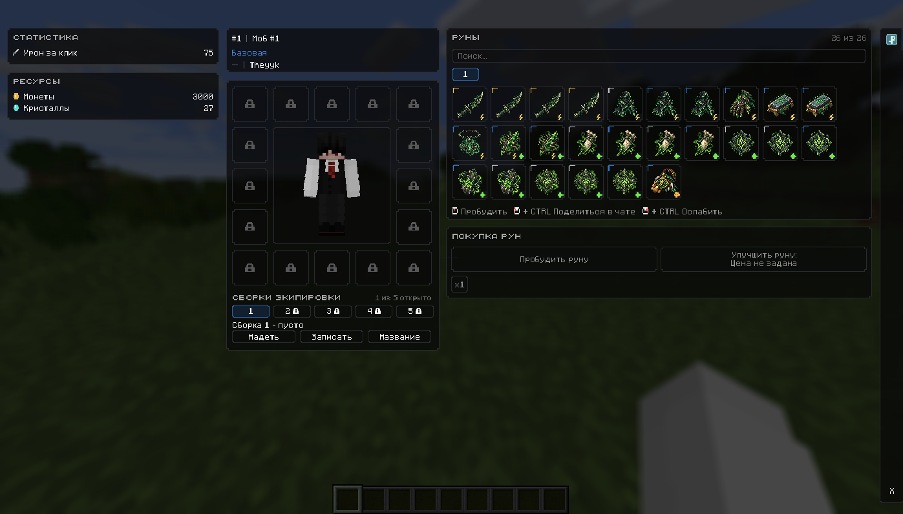

# v1.1.4 archive integration inventory and handoff

Base: develop c3bff3077f843123b86ed997bffb31f24db4380a, matching origin/develop after fetch on 2026-10-10. Initial feature/permission-archive-prep was clean at the same commit. Work branch: feature/v1.1.4-archive-integration.

Archive: archive/gui-polish-cristalix-pending f5700b27402ffe90e4f0b7f492223e173024c958. Backup E:/MyProject/Backups/gui-polish-cristalix-pending.bundle verified successfully; full-history head matches the archive. Neither archive nor bundle was checked out or merged.

## Inventory / decisions

| File | Difference | Integration decision |
| --- | --- | --- |
| CardsGuiScreen.java | Palette, panel geometry, detached purchase panel, equipment layout, headings, stepped pixel-snapped surfaces, rune hover/rank overlays, navigation presentation; also lifecycle and nonessential code churn | Import named presentation methods selectively; retain current init/close, input, search, canvas mouse conversions, purchase availability, amount cycling, awakening and packet handling. Final parity pass restores the archive code-drawn navigation/stat icons under the already recorded GUI presentation scope; no new texture assets. |
| GuiFontRenderer.java | Seven body / Five heading OTF, fallback glyphs, nearest-filter raster per scale, bounded texture cache, pixel snapping | Integrate screen-local font renderer; guard degenerate transforms and align raster cache scale. No global Minecraft font replacement. |
| gui_blur.json | Only final newline removed in archive | Keep develop byte-for-byte; no shader parameter change. |
| fonts/README.md | Origin and embedded metadata documented, no license text | Preserve provenance; add link to support-response decision. |
| minecraft_five.otf | 20,480 bytes; blob afe4225317ca111a3415884a36b86e7678dcc9a8 | Import byte-for-byte under documented noncommercial support-response scope. |
| minecraft_seven.otf | 30,784 bytes; blob 490e2ca36b5c86014ee96b6b63bc868bdf345393 | Import byte-for-byte under the same scope. |

Archive workflow/version/test changes are not restored. Version updated independently to 1.1.4. Asset guard permits only the two named fonts; other pending theme/texture paths stay blocked. Server, domain, network, Mongo and catalog/tests remain develop versions. Surface snapping reuses a buffer instead of allocating per surface; rank corners render once after the icon.

## Roadmap

1. v1.1.4: selective archive integration, permission record, local build/regression checks and runtime checklist; main chat handles push/PR, CI, review and merge.
2. v1.1.5: GUI architecture cleanup only after v1.1.4 review; split responsibilities without gameplay changes. Not started here.
3. v1.1.6: GuiLayout / GuiTheme after cleanup, preserve scaling and input contracts.
4. v1.2.0: stabilization, runtime validation, complete permission/attribution notice and release review.

## Local validation

Gradle offline build includes compile, reobfuscation, test and runeInventoryRegression (26 fixed poison slots, legacy records, purchase lock, awakening and rank checks). These checks do not exercise OpenGL/Minecraft GUI behavior. Final build result and unchanged-method checks are recorded in the handoff below.

## Runtime checklist — pending interactive Minecraft verification

No runtime pass is claimed. Run with the existing test server/resource pack; do not change production Mongo data.

- Open/close repeatedly; resize/fullscreen, GUI scales 1/2/3/Auto, narrow and wide viewports. Check purchase panel and close button bounds, cursor hit targets, tooltips and pixel borders.
- Check Five headings, Seven body, Cyrillic, prices, x1/x5/x10/x100 labels and fitting; repeated scale changes must not grow the font texture cache without bounds.
- Search by name/type, case and whitespace; switching decks preserves search and slot behavior. Search field clicks align with its drawn position.
- Purchase each amount with sufficient/insufficient balance, empty/partial/26 slots; verify server totals and disabled full-collection purchase.
- Middle-click awakening for normal/silver/gold ranks; confirm locked/full/max-rank states and no new sharing/weakening mechanics.
- Blur: no active shader, foreign active shader, shader failure/unsupported hardware, close/reopen and resize; never stop another owner's shader.
- Verify all 16 equipment placeholders and 5 build placeholders; no new equipment mechanics.

Push/PR/CI/merge are intentionally left to the main chat. v1.1.5 has not begun.

## Final handoff evidence

- Final offline Gradle build: SUCCESS; compile/reobfuscation/test/check and runeInventoryRegression passed on 2026-10-10.
- Critical methods compared exactly to develop: initGui, onGuiClosed, actionPerformed, updatePurchaseAvailability, matchesSearch, canvasMouseX/Y, mouseClicked, keyTyped, updateAmountButtonSelection. All unchanged.
- No domain/server/network/Mongo/catalog/test changes; gui_blur.json unchanged.
- Both OTF Git blob hashes match the inventory above. JAR contains both fonts, font renderer and blur resource.
- Support screenshot SHA256 matches the supplied original: 85EA770EE223CEA7E124A1FC038E05B5FFFCB3C6E7877C5D6527EE2CDC9F1DB0.
- git diff --check passed. No push, PR, merge or remote CI was performed.
- Manual runtime checklist remains pending and must be reported as such during review. No interactive Minecraft verification or Mongo writes were performed.

## Final archive parity pass — 2026-10-10

Compared the complete archive-to-current diff, including all 13 differing paths, and inspected both original attached screenshots: final reference image(20261010-141032).png and pre-pass runtime image(20261010-140601).png. The previous selective integration omitted the following presentation details; this pass restores them:

- Left statistics/resources: exact archive 10px code-drawn sword, gold coin and turquoise crystal icons, 5px label gap, white labels/values and right-aligned values. Five headings use HEADING_TEXT_COLOR; archive heading-to-row spacing replaces the old divider lines.
- Navigation: exact code-drawn turquoise rune glyph (stone 0xFF487C86, edge 0xFF87B6BF, rune 0xFFD0F4F3), hover fill and selected right-edge line instead of the item icon and square selected frame. Navigation strip uses the archive surface; bottom X has no inner button frame.
- Purchase: disabled upgrade restores two centered lines, `Улучшить руну:` / `Цена не задана`. Available purchase restores `Купить руну:` / price on a second line. Full/max-rank labels, enabled state, price calculation and purchase/awakening semantics stay current.
- Button text: archive DISABLED_TEXT_COLOR restores readable disabled purchase text; equipment/loadout presentation buttons with id -1 retain white labels even while disabled, as in the reference. This changes rendering only.

### Remaining inventory / intentional differences

Panel color constants, main/purchase panel geometry, square amount control, search/count, 16 equipment placeholders and lock drawing, character/player block, loadout row, rune grid sizing, hover/instruction row and right-edge anchoring already matched the archive and were retained. Exact archive method comparisons passed for updateLayout, updateRuneGridLayout, left statistics/icon methods, central presentation and rune action hints (allowing the existing PanelButton class name).

Remaining CardsGuiScreen differences are modern lifecycle/input/search/purchase implementation, class naming/formatting/comments, reusable surface transform buffer, and omission of an extra pre-icon Earth rank-corner draw. The final post-icon rank overlay is retained; no duplicate archive draw is needed. GuiFontRenderer retains its degenerate-transform guard and quantized cache/raster scale. Both fonts remain byte-for-byte archive originals. gui_blur.json remains unchanged; differing world/background appearance between screenshots is not evidence for changing blur ownership or parameters and needs runtime review.

Other archive differences (.github release workflow, README, build version/mcmod metadata, permission evidence, font provenance, inventory documentation, screenshot and test wording) are intentionally not restored. No server/domain/network/Mongo/catalog/test changes or new external assets were introduced. Version remains 1.1.4; roadmap is unchanged.

### Verification

- Offline Gradle `build test check runeInventoryRegression`: BUILD SUCCESSFUL; compile/reobfuscation, test/check and 26-slot poison catalog, awakening/purchase-lock and rank regression passed.
- initGui, onGuiClosed, actionPerformed, matchesSearch, canvasMouseX/Y, runeMatchesSearch, mouseClicked, keyTyped and updateAmountButtonSelection match pre-pass HEAD exactly. updatePurchaseAvailability differs only in the available-purchase label string.
- Built customguimod-1.1.4.jar verified: both OTF files match archive bytes, GuiFontRenderer and screen/button classes are present, compiled navigation glyph colors and upgrade second line are present, manifest version is 1.1.4.
- git diff --check passed before the commit. No push/PR/merge/remote CI or v1.1.5 work.
- Manual runtime verification remains required: compare the new GUI with the reference at the same window/GUI scale, check icon alignment, disabled/multiline text, navigation hover/X, rank overlays, ordinary/wide layouts, search/input, x1/x5/x10/x100, purchase/awakening and repeated blur open/close. No post-pass interactive Minecraft screenshot or runtime test is claimed.

## Final runtime verification

Manual runtime verification completed successfully after the final archive parity pass.

Verified:

- final Five / Seven typography and headings;
- stat/resource icons with white labels and aligned values;
- custom rune navigation glyph and close control;
- two-line purchase / upgrade presentation;
- rune search, hover, rank overlays and purchase states;
- x1 / x5 / x10 / x100 amount cycling and purchases;
- awakening / full-collection behavior;
- 16 equipment slots and loadout presentation;
- GUI scaling in full, wide and compact window sizes;
- blur activation, cleanup and repeated GUI reopen.

Special stress scenarios such as foreign shaders, unsupported graphics hardware and renderer cache stress were not part of this manual pass.

### Final v1.1.4 screenshots

